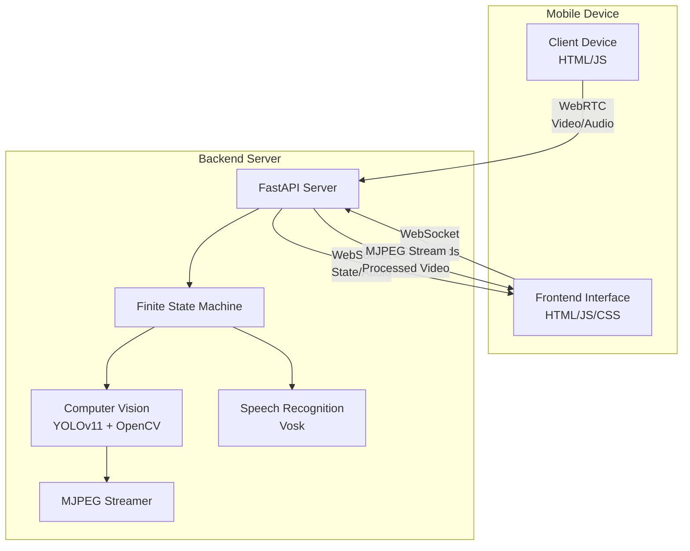

# AI Navigation Assistant Design Document

## Overview

The AI Navigation Assistant is a distributed real-time navigation system designed to provide audio-guided walking assistance using computer vision and AI processing. The system architecture separates concerns across three main components: a lightweight mobile client for sensor data capture, a powerful backend server for AI processing and decision-making, and a responsive frontend for user interaction and feedback delivery.

The system operates on a finite state machine model to ensure predictable and safe navigation behavior, with closed-loop feedback mechanisms that verify user compliance with safety instructions before proceeding to subsequent navigation states.

**Critical Design Consideration**: The server-centric architecture introduces network latency that makes this design suitable for development, testing, and non-critical navigation tasks, but requires on-device processing for production mobility applications where immediate obstacle warnings are essential.

## Architecture

### Operating Modes

#### Monitoring Mode (Default)
- **Frontend**: Continuously displays processed video stream with AI overlays
- **Visual feedback**: Shows real-time object detection, FSM states, and system status
- **Audio**: Muted - no voice guidance
- **Purpose**: System monitoring, supervision, and visual analysis

#### Navigation Mode (User-Activated)
- **Frontend**: Same visual monitoring PLUS active audio guidance
- **Audio feedback**: Plays navigation instructions with urgency-based priority
- **Voice guidance**: "Path clear", "Obstacle detected", emergency alerts
- **Purpose**: Active navigation assistance with audio commands

### High-Level Architecture



### Component Communication Flow

1. **Client → Backend**: Raw video/audio streams via WebRTC
2. **Frontend → Backend**: Control commands via WebSocket
3. **Backend → Frontend**: State updates and audio commands via WebSocket
4. **Backend → Frontend**: Processed video with overlays via MJPEG stream

### Technology Stack

- **Client Device**: HTML5, JavaScript, WebRTC APIs
- **Backend Server**: Python, FastAPI, Uvicorn, OpenCV, Ultralytics YOLOv11, Vosk
- **Frontend Interface**: HTML5, CSS3, JavaScript, Web Speech API
- **Communication**: WebSocket, WebRTC, HTTP streaming

## Components and Interfaces

### 1. Client Device Component

**Purpose**: Sensor data capture and streaming relay

**Key Interfaces**:
- `navigator.mediaDevices.getUserMedia()` for camera/microphone access
- WebRTC PeerConnection for real-time streaming
- Optional biometric sensor APIs for vital data capture

**Implementation Details**:
- Minimal processing footprint - acts as "dumb" sensor relay
- Handles WebRTC connection establishment and maintenance
- Implements automatic reconnection logic for network interruptions
- Supports optional integration with device health sensors (heart rate, accelerometer)

### 2. Backend Server Component

**Purpose**: Central AI processing and navigation logic

**Core Modules**:

#### 2.1 FastAPI Application Server
```python
# Key endpoints and WebSocket handlers
@app.websocket("/ws")
async def websocket_endpoint(websocket: WebSocket)

@app.get("/processed_video_stream")
async def video_stream()

@app.post("/webrtc/offer")
async def handle_webrtc_offer()
```

#### 2.2 Finite State Machine (FSM)
```python
class NavigationState(Enum):
    STATE_IDLE = "idle"
    STATE_SCANNING = "scanning" 
    STATE_GUIDING = "guiding"
    STATE_BLOCKED = "blocked"

class NavigationFSM:
    def transition_to(self, new_state: NavigationState)
    def process_frame(self, frame: np.ndarray)
    def handle_audio_input(self, audio_data: bytes)
```

**State Transition Logic**:
- **IDLE → SCANNING**: On "start" command
- **SCANNING → GUIDING**: When user stationary + clear path detected
- **GUIDING → BLOCKED**: When obstacle detected by YOLOv11
- **BLOCKED → SCANNING**: When user stopped + "scan" command recognized
- **Any State → IDLE**: On "stop" command

#### 2.3 Computer Vision Pipeline
```python
class VisionProcessor:
    def __init__(self):
        self.yolo_model = YOLO('yolov11n.pt')
        self.optical_flow = cv2.calcOpticalFlowPyrLK
        
    def detect_obstacles(self, frame) -> List[Detection]
    def calculate_optical_flow(self, prev_frame, curr_frame) -> float
    def draw_overlays(self, frame, detections, safe_path) -> np.ndarray
```

#### 2.4 Speech Recognition Module
```python
class VoiceCommandProcessor:
    def __init__(self):
        self.vosk_model = vosk.Model("model-path")
        
    def process_audio_stream(self, audio_data) -> Optional[str]
    def detect_scan_intent(self, transcription) -> bool
```

### 3. Frontend Interface Component

**Purpose**: Continuous visual monitoring with optional audio guidance

**Operating Modes**:
- **Monitoring Mode**: Always displays processed video stream with visual feedback
- **Navigation Mode**: Adds audio guidance to visual monitoring when activated

**Key Modules**:

#### 3.1 WebSocket Communication Manager
```javascript
class WebSocketManager {
    connect(url)
    sendCommand(command)
    onMessage(callback)
    onStateChange(callback)
}
```

#### 3.2 Video Display Controller
```javascript
class VideoDisplayController {
    connectToStream()      // Auto-connects on frontend load
    isStreamConnected()    // Always available for monitoring
    onStatusChange(callback)
}
```

#### 3.3 Audio Feedback System
```javascript
class AudioFeedbackSystem {
    speak(text, urgency = 'normal')    // Only when navigation active
    setLanguage(languageCode)
    adjustVolume(urgencyLevel)
    stop()                             // Mute guidance when navigation stopped
}
```

#### 3.4 Navigation Controller
```javascript
class NavigationApp {
    isNavigating: boolean              // Controls audio guidance state
    handleAudioMessage(text, state)   // Always shows visual, audio only if navigating
    showVisualFeedback(text, state)   // Always displays for monitoring
    toggleNavigation()                 // Starts/stops audio guidance only
}
```

## Data Models

### Core Data Structures

#### Navigation State Message
```python
@dataclass
class NavigationMessage:
    state: NavigationState
    speak: Optional[str] = None
    set_lang: Optional[str] = None
    timestamp: datetime = field(default_factory=datetime.now)
```

#### Detection Result
```python
@dataclass
class Detection:
    class_id: int
    confidence: float
    bbox: Tuple[int, int, int, int]  # x1, y1, x2, y2
    class_name: str
```

#### Optical Flow Result
```python
@dataclass
class MotionAnalysis:
    flow_magnitude: float
    is_stationary: bool
    confidence: float
    motion_vectors: np.ndarray
```

#### Biometric Data (Optional)
```python
@dataclass
class BiometricData:
    heart_rate: Optional[int] = None
    stress_level: Optional[float] = None
    fatigue_indicator: Optional[float] = None
    timestamp: datetime = field(default_factory=datetime.now)
```

### Path Calculation Algorithm

The system calculates safe navigation paths using a grid-based approach:

1. **Frame Division**: Divide camera frame into grid cells (e.g., 8x6 grid)
2. **Obstacle Mapping**: Mark cells containing detected obstacles as unsafe
3. **Path Generation**: Calculate clear corridor from bottom-center upward
4. **Safety Margins**: Apply buffer zones around obstacles
5. **Visual Overlay**: Render green tiles for safe path, red boxes for obstacles

## Error Handling

### Network Resilience
- **WebRTC Connection Loss**: Automatic reconnection with exponential backoff
- **WebSocket Disconnection**: Client-side reconnection logic with state recovery
- **Stream Interruption**: Graceful degradation with user notification

### AI Processing Failures
- **YOLOv11 Model Loading**: Fallback to basic motion detection
- **Vosk STT Failure**: Visual prompts for manual navigation reset
- **OpenCV Processing Errors**: Frame skipping with error logging

### State Machine Error Recovery
```python
class FSMErrorHandler:
    def handle_invalid_transition(self, current_state, attempted_transition)
    def recover_from_processing_error(self, error_context)
    def emergency_stop_protocol(self)
```

### Safety Protocols
- **Processing Latency Monitoring**: Alert if frame processing exceeds safe thresholds
- **Emergency Stop**: Immediate transition to BLOCKED state on critical errors
- **Fail-Safe Audio**: Pre-recorded emergency messages when TTS fails

## Testing Strategy

### Unit Testing
- **FSM State Transitions**: Verify all valid and invalid state changes
- **Computer Vision Functions**: Test obstacle detection accuracy with known datasets
- **Audio Processing**: Validate speech recognition with sample voice commands
- **Path Calculation**: Test safe path generation with various obstacle configurations

### Integration Testing
- **WebRTC Streaming**: End-to-end video/audio transmission testing
- **WebSocket Communication**: Message delivery and state synchronization
- **Cross-Component Coordination**: Full navigation workflow testing

### Performance Testing
- **Latency Measurement**: Frame processing time under various loads
- **Memory Usage**: Long-running session resource consumption
- **Network Bandwidth**: Stream quality under different connection conditions

### Safety Testing
- **Emergency Scenarios**: Response time to critical obstacle detection
- **Network Failure Recovery**: Behavior during connection interruptions
- **False Positive Handling**: System response to incorrect obstacle detection

### Accessibility Testing
- **Audio Clarity**: Speech synthesis quality across different devices
- **Visual Contrast**: Overlay visibility under various lighting conditions
- **User Interface**: Navigation system usability for visually impaired users

## Performance Considerations

### Latency Optimization
- **Frame Processing Pipeline**: Asynchronous processing to minimize blocking
- **Model Optimization**: Use YOLOv11n (nano) for faster inference
- **Network Optimization**: WebRTC configuration for minimal delay

### Resource Management
- **Memory Pooling**: Reuse frame buffers to reduce garbage collection
- **CPU Utilization**: Balance between accuracy and processing speed
- **GPU Acceleration**: CUDA support for YOLOv11 inference when available

### Scalability Design
- **Multi-Client Support**: Backend architecture supports multiple concurrent users
- **Load Balancing**: Horizontal scaling capability for high-demand scenarios
- **Resource Monitoring**: Real-time performance metrics and alerting

## Security Considerations

### Data Privacy
- **Local Processing**: No permanent storage of video/audio streams
- **Encrypted Communication**: TLS/WSS for all network communications
- **Biometric Data Protection**: Optional sensor data encrypted in transit

### Network Security
- **WebRTC Security**: DTLS encryption for media streams
- **Authentication**: Optional user authentication for backend access
- **Rate Limiting**: Protection against DoS attacks on WebSocket endpoints

### Device Security
- **Permission Management**: Proper handling of camera/microphone permissions
- **Secure Origins**: HTTPS requirement for WebRTC functionality
- **Data Minimization**: Only collect necessary sensor data